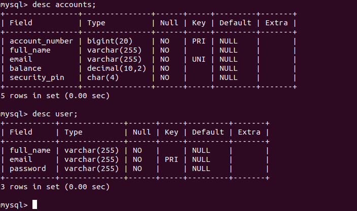

 **Console-Based Java Banking Application**

---

# **Secure Banking - Console-Based Java Banking Application**  

  
  

## **🔹 Overview**  
Secure Banking is a **console-based Java banking system** that enables users to perform **secure transactions, account management, and user authentication** with **MySQL as the database backend**.  

---

## **📌 Features**
✅ **User Authentication** – Secure login & registration  
✅ **Account Management** – Create, view, and manage accounts  
✅ **Fund Transfer** – Secure money transfer between accounts  
✅ **Transaction History** – View past transactions  
✅ **Deposit & Withdraw** – Update account balance  
✅ **Database-Driven** – Uses **MySQL** for persistent data storage  

---

## **🛠️ Technologies Used**  
- **Java** (JDK 11+)  
- **MySQL** (Database)  
- **JDBC** (Database connectivity)  
- **Git & GitHub** (Version control)  
- **VS Code / IntelliJ** (Development environment)  

---

## **📂 Project Structure**  
```
Banking-Management-System/
│── src/
│   ├── BankingManagementSystem/
│   │   ├── BankingApp.java   # Main application
│   │   ├── User.java         # User authentication & management
│   │   ├── Accounts.java     # Account-related operations
│   │   ├── AccountManager.java # Transaction handling
│── resources/
│   ├── application.properties  # Database configurations
│── lib/
│   ├── mysql-connector-java.jar  # MySQL JDBC Driver
│── README.md  # Project Documentation
```

---

## **🗄️ Database Schema**  




### **🔹 User Table (`user`)**  
Stores registered users' details.  
```sql
CREATE TABLE user (
    user_id INT AUTO_INCREMENT PRIMARY KEY,
    full_name VARCHAR(255) NOT NULL,
    email VARCHAR(255) UNIQUE NOT NULL,
    password VARCHAR(255) NOT NULL
);
```

### **🔹 Accounts Table (`accounts`)**  
Stores account details for users.  
```sql
CREATE TABLE accounts (
    account_id INT AUTO_INCREMENT PRIMARY KEY,
    user_id INT,
    account_number VARCHAR(20) UNIQUE NOT NULL,
    account_type ENUM('SAVINGS', 'CURRENT') NOT NULL,
    balance DECIMAL(10,2) DEFAULT 0,
    FOREIGN KEY (user_id) REFERENCES user(user_id) ON DELETE CASCADE
);
```

### **🔹 Transactions Table (`transactions`)**  
Records transaction history.  
```sql
CREATE TABLE transactions (
    transaction_id INT AUTO_INCREMENT PRIMARY KEY,
    account_id INT,
    transaction_type ENUM('DEPOSIT', 'WITHDRAWAL', 'TRANSFER') NOT NULL,
    amount DECIMAL(10,2) NOT NULL,
    transaction_date TIMESTAMP DEFAULT CURRENT_TIMESTAMP,
    FOREIGN KEY (account_id) REFERENCES accounts(account_id) ON DELETE CASCADE
);
```


---

## **🚀 Getting Started**  
### **🔹 Prerequisites**  
✅ Install [Java JDK 11+](https://www.oracle.com/java/technologies/javase-jdk11-downloads.html)  
✅ Install [MySQL Server](https://dev.mysql.com/downloads/installer/)  
✅ Install [VS Code](https://code.visualstudio.com/) (or IntelliJ)  

### **🔹 Setup Instructions**
1️⃣ **Clone the Repository**  
```sh
git clone https://github.com/YOUR_USERNAME/Secure-Banking.git
cd Secure-Banking
```

2️⃣ **Set Up Database**  
- Open MySQL and run:  
  ```sql
  CREATE DATABASE banking_db;
  USE banking_db;
  ```
- Copy and execute the **schema scripts** provided above.

3️⃣ **Configure Database Connection**  
- Open `application.properties` and update:  
  ```properties
  jdbc.url=jdbc:mysql://localhost:3306/banking_db
  jdbc.user=root
  jdbc.password=yourpassword
  ```
  
4️⃣ **Compile and Run**  
```sh
javac -cp "lib/mysql-connector-java.jar" -d bin src/BankingManagementSystem/*.java
java -cp "bin:lib/mysql-connector-java.jar" BankingManagementSystem.BankingApp
```

---

## **📜 License**  
This project is licensed under the **MIT License** – feel free to use and modify it!  

---

## **🙌 Contributing**  
Want to improve this project?  
- Fork the repository 🍴  
- Create a new branch 🚀  
- Make your changes 🛠️  
- Submit a pull request 🔥  
